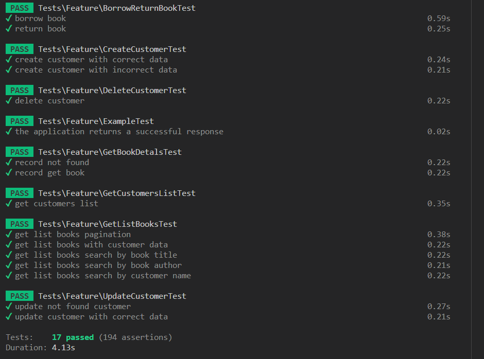

# Simple Book Rental API
### Introduction
API zostało zaimplementowane w frameworku Laravel, umożliwia wypożyczanie książek oraz zarządzanie klientami.

### Endpointy
1. Listowanie książek z paginacją
Endpoint: (GET) /api/v1/books
Query:
    ?page (opcjonalny): Numer strony dla paginacji (domyślnie 1)
    ?type=book&q=phrase (opcjonalny): Wyszukiwanie książek po tytule lub autorze (type=book) lub osobie, która ją posaida (type=customer)
Response:
    status: 200
        Lista książek z paginacją, każda książka zawiera:
        id, title, author,year, status (available/rentaled), borrowedBy

2. Szczegóły książki
Endpoint:(GET) /api/v1/books/{book_id}
Response:
    status: 200 
        Szczegóły książki zawierające:
        id, title, author, year, status (available/rentaled), borrowedBy
    status: 404
        message: Record not found.

3. Lista klientów
Endpoint: (GET) /api/v1/customers
Response:
    status: 200
        Lista klientów zawierająca:
        id, name, surname

4. Szczegóły klienta
Endpoint: (GET) /api/v1/customers/{customer_id}
Response:
    status: 200
        Szczegóły klienta zawierające:
        id, name, surname, lista wypożyczonych książek
    status: 404
        message: Record not found.

5. Dodawanie klienta
Endpoint: (POST) /api/v1/customers

Body:
    name: Imię
    surname: Nazwisko
Response:
    status: 201, body: JSON obiekt klienta 
    status: 422, body: message{error}

6. Edycja klienta
Endpoint: (PUT) /api/v1/customers/{customer_id}
Body:
    name: Imię
    surname: Nazwisko
Response:
    status: 201, body: JSON obiekt klienta 
    status: 500, body: message{error}

7. Usuwanie klienta
Endpoint: (DELETE) /api/v1/customers/{customer_id}
Response:
    status: 204, body: JSON obiekt klienta
    status: 500, body: message{error}

8. Wypożyczanie / Oddawanie książki
Endpoint: (PATCH) /api/v1/books/{book_id}
Body: 
    customerId: id posiadacza książki
    action: ("borrow" lub "return") wypożyczanie / oddawanie
Response:
    status: 200, body: potwierdzenie
    status: 422, body: message{error} 

Uwagi
W przypadku błędów, API zwraca odpowiedzi w formacie JSON z informacjami o błędzie.

### Routes
    

## Testy
    Todatkowo do zadania wykonano feature testy
    > php artisan test

    

## Installation Process

### Clone the repository:

    git clone https://github.com/JanMadon/bookStoreApi_laravel

### Navigate to the project directory:
    cd bookStoreApi_laravel

### Copy the .env.example file to .env 
    cp .env.example .env

### Install PHP dependencies using Composer:
    composer install

### Generate the Laravel application key:
    php artisan key:generate

### Seed your database with data
    php artisan db:seed

### Start the development server:
    php artisan serve

The application will be accessible at http://localhost:8000.

